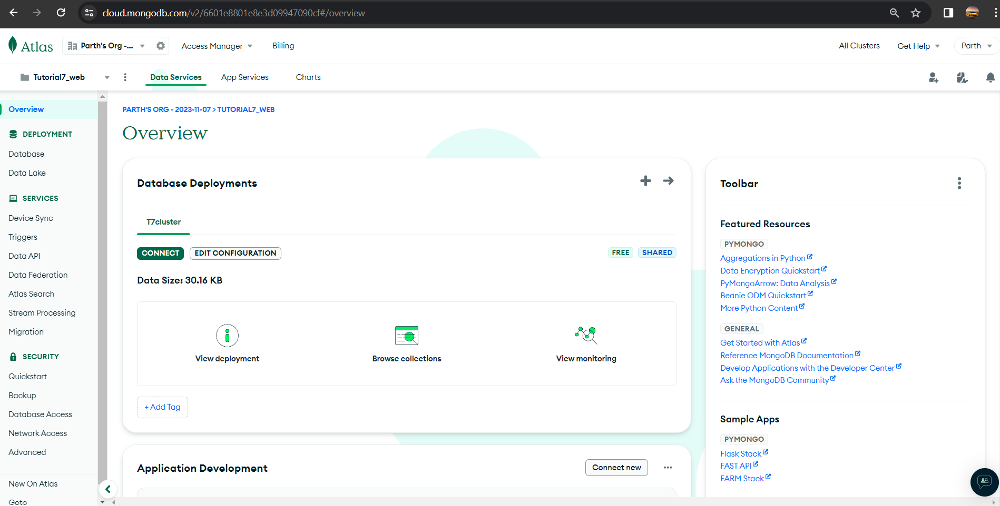
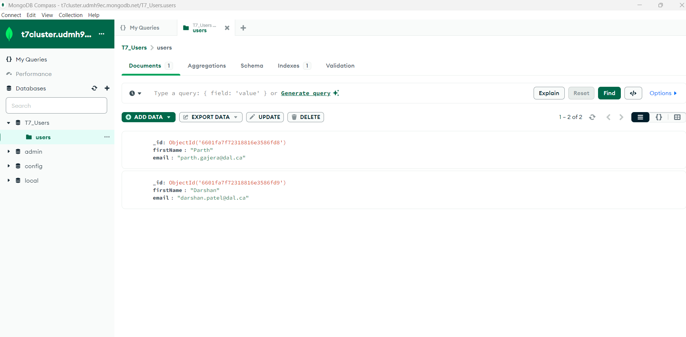

Tutorial 7: REST API with Database

* *Date Created*: 24 Mar 2024
* *Last Modification Date*: 25 Mar 2024
* *Lab URL*: <https://dal.brightspace.com/d2l/le/content/311813/viewContent/4041539/View>
* *Tutorial 5 Link (Gitlab):* <https://git.cs.dal.ca/pgajera/csci-5709-tutorials/-/tree/main/Tutorial7>
* *Deployed App Link (Render):* <https://tutorial-7-e42k.onrender.com/users>

**Note:** As I have used "Render" for the deployement of my app and I am using its free version it might take some time to show the reponse for the first time.

## Author

* [Parth Chhaganlal Gajera](pr769932@dal.ca)

## Built With

* [Flask](https://flask.palletsprojects.com/) - The web framework used to build the application.
* [Visual Studio Code](https://code.visualstudio.com/) - Used for writing and debugging code.
* [Render](https://render.com/) - Used for hosting the website.

Here is the picture of the cluster created & deployment of database instance on [MongoDB Atlas](https://www.mongodb.com/atlas/database)



Here is the picture showing the database "T7_users" in [MongDB compass](https://www.mongodb.com/products/tools/compass), which contains a collection called "users".




## Sources Used

### app.py

*Lines 1-92*

```
from bson import ObjectId
from flask import Flask, request, jsonify
from pymongo import MongoClient
import re

app = Flask(__name__)

# MongoDB Atlas setup
client = MongoClient('mongodb+srv://parthgajera056:<password>@t7cluster.udmh9ec.mongodb.net/?retryWrites=true&w=majority&appName=T7cluster')
db = client['T7_Users']
users_collection = db['users']

def is_valid_email(email):
    return re.match(r"[^@]+@[^@]+\.[^@]+", email)

def user_db_to_dict(user):
    user['_id'] = str(user['_id'])  # Convert ObjectId to string for JSON serialization
    return user

def add_default_users():
    default_users = [
        {"firstName": "Parth", "email": "parth.gajera@dal.ca"},
        {"firstName": "Darshan", "email": "darshan.patel@dal.ca"}
    ]
    for user in default_users:
        if not users_collection.find_one({"email": user["email"]}):
            users_collection.insert_one(user)

@app.route('/users', methods=['GET'])
def get_all_users():
    users_cursor = users_collection.find()
    users_list = [user_db_to_dict(user) for user in users_cursor]
    return jsonify({
        "message": "Users retrieved",
        "success": True,
        "users": users_list
    })

@app.route('/add', methods=['POST'])
def add_user():
    data = request.json
    if 'firstName' not in data or 'email' not in data:
        return jsonify({"message": "Missing data", "success": False}), 400
    if not is_valid_email(data.get('email')):
        return jsonify({"message": "Invalid email address", "success": False}), 400
    if users_collection.find_one({"email": data["email"]}):
        return jsonify({"message": "User with this email already exists", "success": False}), 400

    new_user = {"firstName": data['firstName'], "email": data['email']}
    users_collection.insert_one(new_user)
    return jsonify({"message": "User added", "success": True}), 201


@app.route('/update/<id>', methods=['PUT'])
def update_user(id):
    user_id = ObjectId(id)
    data = request.json
    update_data = {}
    if 'firstName' in data:
        update_data['firstName'] = data['firstName']
    if 'email' in data:
        if not is_valid_email(data['email']):
            return jsonify({"message": "Invalid email address", "success": False}), 400
        update_data['email'] = data['email']
    result = users_collection.update_one({"_id": user_id}, {"$set": update_data})
    if result.matched_count:
        return jsonify({"message": "User updated", "success": True})
    else:
        return jsonify({"message": "User not found", "success": False}), 404

@app.route('/user/<id>', methods=['GET'])
def get_user(id):
    user_id = ObjectId(id)
    user = users_collection.find_one({"_id": user_id})
    if user:
        return jsonify({"success": True, "user": user_db_to_dict(user)})
    else:
        return jsonify({"message": "User not found", "success": False}), 404


@app.route('/delete/<id>', methods=['DELETE'])
def delete_user(id):
    user_id = ObjectId(id)
    result = users_collection.delete_one({"_id": user_id})
    if result.deleted_count:
        return jsonify({"success": True, "message": "User deleted"}), 200
    else:
        return jsonify({"message": "User not found", "success": False}), 404

if __name__ == '__main__':
    add_default_users()  # Add default users on app start
    app.run(host="0.0.0.0", port=5000, debug=True)


```
Here the above code written in flask for creating a simple REST API and connecting to MongoDB using python. The reference is taken from the websites mentioned below:

1. Majority of the code reference is taken form the code of [Tutorial 5](https://github.com/ParthGajera-119/Tutorial-5/blob/main/app.py) and then modification is done based on the requirements.

2. How to connect the MongoDB database to the flask app is taken form the website [How to connect flask app to MongoDB database of "Geeks for Geeks"](https://www.geeksforgeeks.org/sending-data-from-a-flask-app-to-mongodb-database/)

3. The Route made for different endpoints is taken from the [Routing in flask website of "HackersandSlackers".](https://hackersandslackers.com/flask-routes/)

4. For sending the JSON repsonse in flask is taken from the website [How to return a JSON response from a Flask API of "Geeks for Geeks".](https://www.geeksforgeeks.org/how-to-return-a-json-response-from-a-flask-api/)

## Acknowledgments

I learned how to use the route for making endpoints  and also how to handle data in backend from the [official documentation of Flask.](https://flask.palletsprojects.com/)

Also, learned about the MongoDB database and the CRUD operations that can be performed in it from the [official documentation of MongoDB](https://www.mongodb.com/docs/manual/crud/).